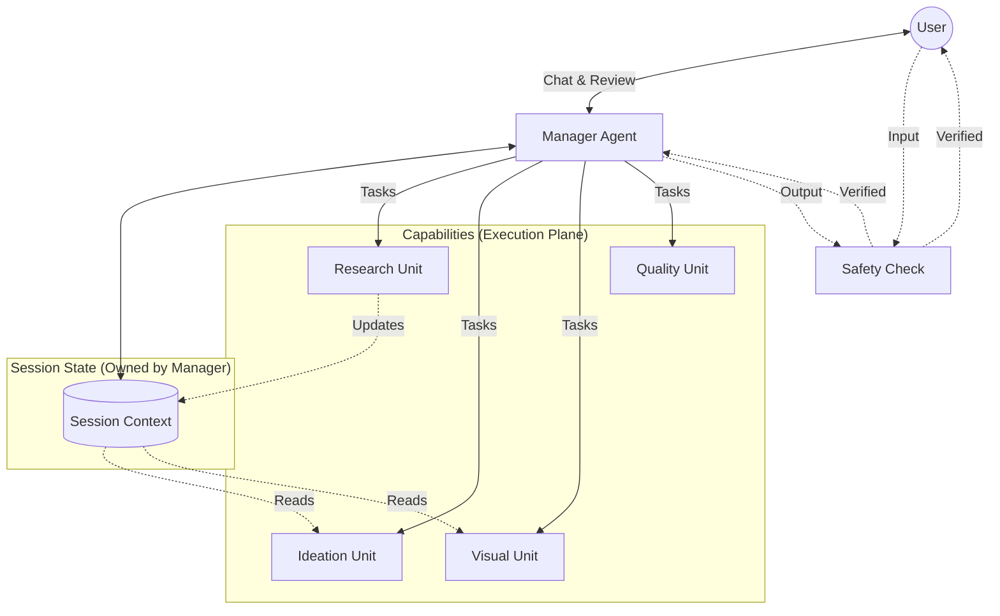
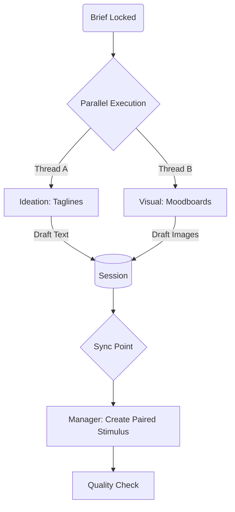

# Multi-Agent System Architecture: TalkNact Concept Generator

## 1. System Overview

The **TalkNact Concept Generator** utilizes a **Capability-Driven Graph** architecture. A **Manager Agent** (Project Lead) acts as the central interface, first conversing with the user to lock a brief, and then dynamically routing tasks to specialized workers.

**Safety Checks** are implemented as a **Guardian Layer** at the entry and exit points (User Input & Final Output) to ensure compliance while optimizing for cost and latency.

### Macro Architecture: Hub & Shared State

> **Architectural Semantic Note**:
> *   **Manager**: Owns the workflow and the `SessionContext`.
> *   **Capabilities**: `Research`, `Ideation`, and `Visual` are execution units that read from `SessionContext`.
> *   **Safety Boundary**: Checks apply strictly to User Input and Final Output. Internal traffic is trusted to save costs.



---

## 2. Process Workflow

### Phase A: Briefing & Locking (Conversation)
Before generating content, the Manager ensures clarity.

1.  **User**: "I need ideas for a soda."
2.  **Manager**: "Sure. Who is the target audience? Any specific tone?" (Briefing Mode)
3.  **User**: "Gen Z, playful tone."
4.  **Manager**: "Got it. Locking Brief. Proceeding to generation." (Transition to Execution)

### Phase B: Execution (Parallel & Dynamic)

> **Parallelism**: Tagline (Text) and Visuals (Image) are generated concurrently to speed up the loop.



### Phase C: Continuity (Next Actions)
After presenting the output, the Manager determines the next state based on User Intent:

*   **Refinement**: User says "Make it funnier".
    *   *Action*: Update `Brief.tone`, Keep `Context`, Re-trigger `Ideation`.
*   **New Direction**: User says "Now let's do a car brand".
    *   *Action*: Reset `Context`, Create New `Brief`.
*   **Clarification**: User asks "Why this color?".
    *   *Action*: Answer directly (Chat Mode), No utilization of workers.

---

## 3. Micro-Architecture & Logic

### A. Cost-Optimized Safety (The Barrier)
To reduce latency and LLM costs, we do **not** intercept every internal agent call.

*   **Flow**: `User Input -> Safety Check -> Manager -> ... (Trusted Internal Zone) ... -> Manager -> Safety Check -> Output`

### B. Session Context (The Specifics)

**Single Source of Truth**: The `SessionContext` is a live, mutable object.
*   **Initialization**: Created at session start.
*   **Freshness**: It is **not** passed as a static copy. Agents read the *latest* state from the memory store at the moment of execution. This ensures that if the Research Unit updates the context context milliseconds before the Ideation Unit runs, the Ideation Unit sees the new data.

### The `SessionContext` Structure

```json
{
  "session_id": "uuid",
  "status": "BRIEFING | EXECUTION | REVIEW", // Workflow Stage
  "brief": {
    "objective": "Launch new soda",
    "constraints": ["No sugar"],
    "locked": true
  },
  "generation_state": {
    "artifacts": {
        "text_concepts": [ ... ],
        "visual_assets": [ ... ]
    },
    "conversation_history": [ ... ]
  }
}
```

---

## 4. Architecture Rationale (Refined)

### Why "Manager" instead of "Orchestrator"?
*   **Role Clarity**: The agent effectively "manages" the project—taking the brief, assigning tasks to specialists, and reviewing work—rather than just mechanically routing packets.

### Why "Briefing Phase"?
*   **Quality at Source**: Most "bad" AI outputs come from vague inputs. By forcing a conversational lock-in *before* burning tokens on generation, we ensure higher success rates and lower costs.

### Why Input/Output Guardrails Only?
*   **Efficiency**: Internal agents are prompted systemically and are less likely to "jailbreak" themselves. Checking every intermediate step triples the latency and cost. Checking the *entrance* and *exit* provides 95% of the safety value at 10% of the cost.
