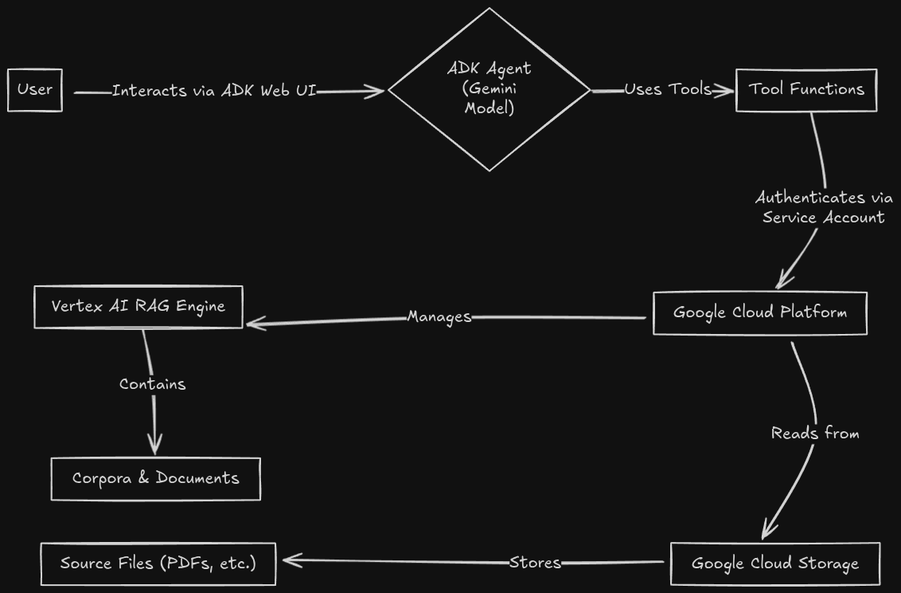
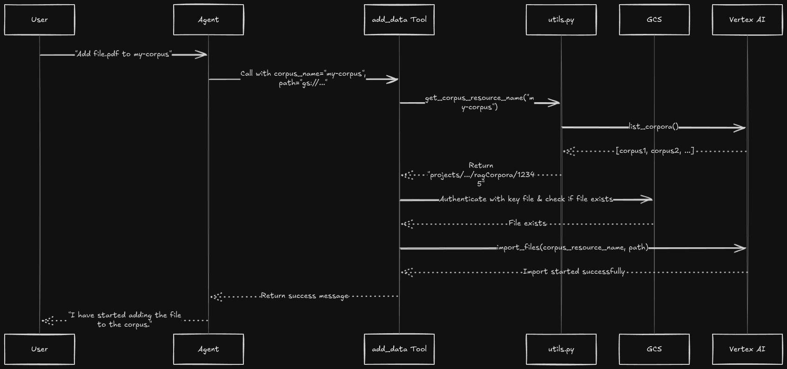

# Expert Guide: Building a Production-Ready RAG Agent with the ADK

This tutorial provides a comprehensive, step-by-step guide to building, configuring, and deploying a sophisticated Retrieval-Augmented Generation (RAG) agent using the Google Agent Development Kit (ADK). We will go beyond simple examples to tackle the real-world challenges of authentication, permissions, and robust error handling that are critical for a production-ready application.

This guide is based on a real-world troubleshooting session, capturing the key learnings and final, correct configurations.

## 1. Introduction & Core Concepts

### What is this Project?

This project is a conversational AI agent that can manage and query a private knowledge base using Google's Vertex AI RAG Engine. It exposes a suite of tools that allow a user to create document collections (called "corpora"), add documents from Google Cloud Storage (GCS), and ask questions that the agent will answer using the information in those documents.

### High-Level Architecture

The entire system is composed of three main parts: the User, the ADK Agent, and Google Cloud Platform (GCP) services.



### Project Structure

The agent is organized into a Python package (`rag_with_adk`) with a clear separation of concerns.

```
rag_with_adk/
│
├── __init__.py           # Makes the directory a Python package.
├── agent.py              # Defines the core agent, its model, and its tools.
├── config.py             # Central configuration for project ID, RAG settings, etc.
├── utils.py              # Helper functions for common tasks like finding corpora.
│
├── create_corpus.py      # Tool: Creates a new RAG corpus.
├── add_data.py           # Tool: Adds documents from GCS to a corpus.
├── list_corpora.py       # Tool: Lists all available corpora.
├── get_corpus_info.py    # Tool: Gets metadata about a specific corpus.
├── delete_corpus.py      # Tool: Deletes a corpus.
├── delete_document.py    # Tool: Deletes a specific document from a corpus.
├── rag_query.py          # Tool: Asks a question to a corpus.
│
└── rag-accessor-key.json # (Generated) The private key for our service account.
```

---

## 2. Authentication & Permissions: The Definitive Guide

Correctly configuring authentication is the most critical and failure-prone part of building an agent that interacts with cloud services. This section provides the exact, battle-tested steps to create a secure and reliable connection between your agent and Google Cloud.

### The Challenge: Who is the Agent?

When a tool in your agent needs to access a Google Cloud service (like GCS or Vertex AI), it must authenticate. The core problem is that the agent's code, running on a server, has its own identity—a **service account**. We cannot rely on the logged-in user's personal credentials.

Our strategy is to create a dedicated service account with the bare minimum permissions required, and then provide a private key (a password) for this account directly to our agent.

### Step 1: Create the GCS Bucket

First, create a secure, private location to store the documents you want your agent to access.

```bash
# Bucket names must be globally unique. Using your project ID is a good practice.
gcloud storage buckets create gs://<your-unique-bucket-name>
```

### Step 2: Create the Dedicated Service Account

Next, we create a new, dedicated identity for our agent. This is like creating a new "user" that is only allowed to perform specific tasks.

```bash
gcloud iam service-accounts create rag-data-accessor --display-name="RAG Data Accessor"
```

### Step 3: Grant the Service Account GCS Access

Now, we grant our new service account the permission to *read* files from the GCS bucket. We use the `Storage Object Viewer` role, which is a read-only permission, adhering to the principle of least privilege.

```bash
gcloud storage buckets add-iam-policy-binding gs://<your-bucket-name> \
    --member="serviceAccount:rag-data-accessor@<your-project-id>.iam.gserviceaccount.com" \
    --role="roles/storage.objectViewer"
```

### Step 4: Generate and Secure the Service Account Key

This is the most critical step. We generate a private JSON key file that acts as the password for our service account.

```bash
gcloud iam service-accounts keys create rag_with_adk/rag-accessor-key.json \
    --iam-account=rag-data-accessor@<your-project-id>.iam.gserviceaccount.com
```

**CRITICAL SECURITY NOTE:** This key file grants access to your cloud resources. **Never commit it to version control.** Add the filename `rag-accessor-key.json` to your `.gitignore` file immediately.

### Step 5: Connect the Agent to the Key

Finally, we modify the agent's code to load and use this key file for authentication. This provides a direct, unambiguous authentication path.

In `add_data.py`, we use the `google-cloud-storage` library to load the credentials directly from our key file.

```python
# In add_data.py

from google.oauth2 import service_account
from google.cloud import storage
import os

# Construct the full path to the key file, located in the same directory.
KEY_FILE_PATH = os.path.join(os.path.dirname(__file__), 'rag-accessor-key.json')

# ... inside the add_data function ...

# Authenticate using the service account key file.
credentials = service_account.Credentials.from_service_account_file(KEY_FILE_PATH)
storage_client = storage.Client(credentials=credentials)

# Now you can use the storage_client to interact with GCS.
# For example, to check if a file exists:
bucket = storage_client.bucket(bucket_name)
blob = bucket.blob(blob_name)
if not blob.exists():
    # Handle error
```

This robust, key-based authentication was the final solution that resolved all permission errors.

---

## 3. Core Logic and Tool Implementation

With authentication solved, we can now explore the agent's Python code. This section details how the agent is defined, how the tools are structured, and how they interact with the Google Cloud services.

### The Agent Definition (`agent.py`)

The entry point of our agent is `agent.py`. This file is simple but important. It defines the `Agent` object, specifying the underlying model and registering all the Python functions that will be used as tools.

```python
# In agent.py

from google.adk.agents import Agent
# Import all the tool functions
from .add_data import add_data
from .create_corpus import create_corpus
# ... other tool imports

# The root_agent is the main object the ADK will run.
root_agent = Agent(
    name="RagAgent",
    model="gemini-2.5-flash", # Specifies the powerful model for reasoning
    description="Vertex AI RAG Agent",
    # The 'tools' list makes our Python functions available to the agent.
    tools=[
        rag_query,
        list_corpora,
        create_corpus,
        add_data,
        get_corpus_info,
        delete_corpus,
        delete_document,
    ],
)
```
When a user sends a prompt, the Gemini model will decide which, if any, of these functions in the `tools` list to call to fulfill the request.

### The Brains of the Operation (`utils.py`)

The `utils.py` file contains the most important logic in the project. The initial, buggy implementation of these functions was the source of many of the "corpus not found" errors.

The key challenge is that users refer to a corpus by its easy-to-remember **display name** (e.g., "my-test-corpus"), but the Vertex AI API requires a globally unique **full resource name** (e.g., `projects/.../ragCorpora/12345...`).

The corrected `utils.py` solves this by performing a **live lookup**.

```python
# In utils.py

def _find_corpus(name_or_id: str) -> Optional[rag.RagCorpus]:
    """Finds a corpus by its full resource name or display name."""
    # 1. Get a fresh list of ALL corpora from the API.
    corpora = rag.list_corpora()
    # 2. Loop through them to find a match.
    for corpus in corpora:
        if corpus.name == name_or_id or corpus.display_name == name_or_id:
            return corpus
    return None

def get_corpus_resource_name(name_or_id: str) -> Optional[str]:
    """
    Gets the full resource name for a corpus, whether the input is a
    display name or the resource name itself.
    """
    # ... (logic to check if it's already a resource name) ...
    
    # 3. If it's a display name, find the corpus object.
    corpus = _find_corpus(name_or_id)
    # 4. Return the correct full resource name.
    return corpus.name if corpus else None
```
This ensures that no matter how the user refers to the corpus, the tool will always use the correct identifier when calling the Google Cloud API.

### Tool Implementation Deep Dive (`add_data.py`)

The `add_data.py` tool is a perfect example of how all the pieces come together.



This flow demonstrates:
1.  **Natural Language Understanding:** The agent correctly parses the user's request.
2.  **Robust Corpus Lookup:** The tool calls `utils.py` to get the correct, full resource name for the corpus.
3.  **Secure Authentication:** The tool loads the service account key to securely connect to Google Cloud Storage.
4.  **Pre-flight Check:** It verifies the GCS file exists *before* calling the expensive import API, allowing for a better error message.
5.  **API Interaction:** It calls the `rag.import_files` function with the correct, validated parameters.

This robust, multi-step process is what makes the final agent reliable and easy to use.

```